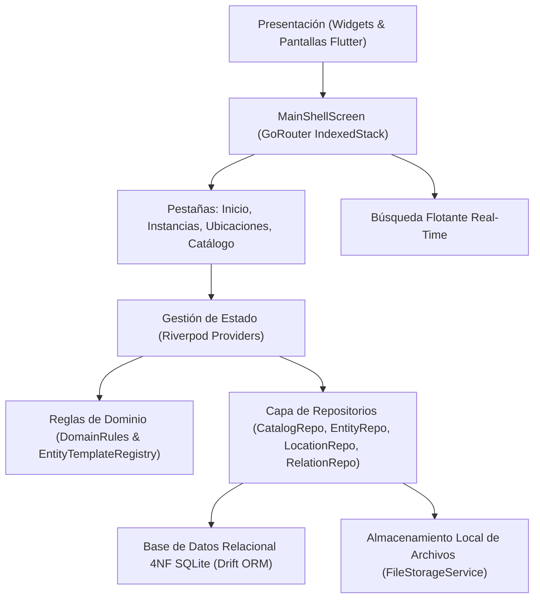

# Platinum World Management System (PWMS)

> **PWMS** es una aplicación personal, offline-first y autocontenida desarrollada con Flutter, Riverpod, GoRouter y Drift (SQLite) diseñada para actuar como el gemelo digital completo del mundo del usuario.

---

## 🌟 Visión del Producto y Filosofía

PWMS unifica objetos físicos, herramientas, seres vivos, documentos, proyectos e infraestructura digital en un modelo relacional normalizado en **Cuarta Forma Normal (4NF)**.

- **Offline-First & Local-First**: No depende de servidores en la nube ni conexión a Internet. SQLite local es la única fuente de verdad.
- **Sin Fricción de Captura**: Información progresiva con foto, nombre o código de barras sin obligar al usuario a llenar datos innecesarios.
- **Historial Automático**: Todo cambio de ubicación, edición o vinculación genera eventos de auditoría automáticamente.
- **Diseño Premium**: Interfaz moderna en Modo Oscuro con Material 3, microanimaciones, ruedas de selección Cupertino (`AppWheelPicker`) y notificaciones flotantes integradas (`AppToast`).

---

## 🏗️ Arquitectura Técnica



---

## 🚀 Funcionalidades Principales

1. **Catálogo Maestro y Sistema de Subespecies**:
   - Clasificación por 5 subgrupos principales: `Objeto`, `Ser Vivo`, `Documento`, `Proyecto`, `Recuerdo`.
   - Gestión jerárquica de **Subespecies y Marcas**: Cada especie posee una o más subespecies (creación implícita de subespecie `Genérica` si no se agregan borradores).
   - Inversión visual: Las pantallas de detalle y listas destacan el nombre de la subespecie como título principal (`Bravia 4K`), presentando la especie general como contexto secundario (`Especie: Televisor (Objeto)`).
2. **Propiedades Físicas Relacionales 4NF**:
   - Registro de magnitudes físicas (Masa, Volumen, Longitud, Superficie, Tiempo, Electricidad, Almacenamiento, Precio, etc.) sin campos nulos en tablas principales.
   - Sugerencia automática de nombres de propiedades según unidades del SI elegidas (ej. `kg` $\rightarrow$ `Masa`, `L` $\rightarrow$ `Volumen`).
3. **Grafo Espacial de Ubicaciones**:
   - Estructura en árbol jerárquico (`Mundo > Casa > Garaje > Estante A > Caja 1`).
   - Conteo recursivo automático de elementos descendientes y protección contra ciclos infinitos de reubicación.
   - Indicador de contenedor relacional `@` en rutas breadcrumb.
4. **Relaciones Dirigidas y Requisitos**:
   - Vínculos dirigidos entre instancias (`PARTE_DE`, `DOCUMENTA`, `PERTENECE_A`, `USA`, `GUARDADO_EN`) con visualización en grafo vertical interactivo.
   - Requisitos de dependencia (`NECESITA`) a nivel de catálogo.
5. **Protección contra Eliminación**:
   - Imposibilidad de eliminar especies o subespecies que posean instancias activas instanciadas en el mundo (restringido en base de datos y UI).
   - Imposibilidad de eliminar la única subespecie de una especie.

---

## 📂 Sitemap de Documentación TÉCNICA (`docs/`)

La documentación detallada de la arquitectura y dominio de PWMS se encuentra centralizada en la carpeta [`docs/`](file:///Users/hakkindavid/Documents/GitHub/PlatinumWorldManagementSystem/docs/):

| Documento | Enlace | Descripción |
| :--- | :--- | :--- |
| **Sitemap y Resumen** | [docs/README.md](file:///Users/hakkindavid/Documents/GitHub/PlatinumWorldManagementSystem/docs/README.md) | Índice general y arquitectura del sistema. |
| **Visión y Filosofía** | [docs/master.md](file:///Users/hakkindavid/Documents/GitHub/PlatinumWorldManagementSystem/docs/master.md) | Especificación del producto y filosofía MVP. |
| **Arquitectura Técnica** | [docs/architecture.md](file:///Users/hakkindavid/Documents/GitHub/PlatinumWorldManagementSystem/docs/architecture.md) | Clean Architecture, Riverpod, GoRouter y Drift. |
| **Esquema de Base de Datos 4NF** | [docs/data_model.md](file:///Users/hakkindavid/Documents/GitHub/PlatinumWorldManagementSystem/docs/data_model.md) | Tablas relacionales SQLite Drift y modelos Freezed. |
| **Reglas de Dominio** | [docs/domain_rules.md](file:///Users/hakkindavid/Documents/GitHub/PlatinumWorldManagementSystem/docs/domain_rules.md) | Fuente de verdad (`DomainRules`), matrices y restricciones. |
| **Jerarquía de Subespecies** | [docs/subspecies_and_brands.md](file:///Users/hakkindavid/Documents/GitHub/PlatinumWorldManagementSystem/docs/subspecies_and_brands.md) | Gestión de subespecies, marcas, fotos y jerarquía visual. |
| **Magnitudes y Unidades SI** | [docs/magnitudes_and_units.md](file:///Users/hakkindavid/Documents/GitHub/PlatinumWorldManagementSystem/docs/magnitudes_and_units.md) | Sistema 4NF de magnitudes, catálogo SI y pickers. |
| **Grafo de Ubicaciones** | [docs/location_graph.md](file:///Users/hakkindavid/Documents/GitHub/PlatinumWorldManagementSystem/docs/location_graph.md) | Grafo jerárquico espacial, recursividad y trayectorias. |
| **Relaciones Dirigidas** | [docs/directed_relations.md](file:///Users/hakkindavid/Documents/GitHub/PlatinumWorldManagementSystem/docs/directed_relations.md) | Relaciones con sentido, grafo vertical y requisitos. |
| **Navegación e Interfaz UI** | [docs/navigation_and_ui.md](file:///Users/hakkindavid/Documents/GitHub/PlatinumWorldManagementSystem/docs/navigation_and_ui.md) | Shell de navegación, modales, toasts y renderizado. |
| **Cadenas de Texto** | [docs/strings.md](file:///Users/hakkindavid/Documents/GitHub/PlatinumWorldManagementSystem/docs/strings.md) | Centralización en `AppStrings` y normas de idioma. |

---

## 🛠️ Comandos de Desarrollo y Verificación

### Análisis Estático de Código
```bash
flutter analyze
```

### Ejecución de Pruebas Unitarias y de Integración
```bash
flutter test test/unit_test.dart
```

### Generación de Código Drift & Freezed
```bash
dart run build_runner build --delete-conflicting-outputs
```
