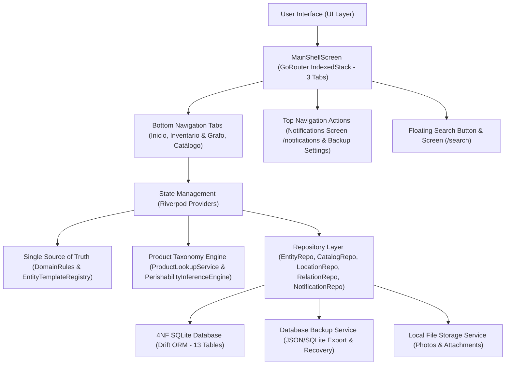

# PWMS — Platinum World Management System Documentation

Welcome to the comprehensive documentation suite for **Platinum World Management System (PWMS)**. PWMS is a personal, offline-first digital twin application built with Flutter, Riverpod, GoRouter, and Drift (SQLite).

---

## Documentation Index & Sitemap

Below is the complete sitemap of the technical documentation for PWMS located in the `docs/` directory:

| Document | Topic & Focus |
| :--- | :--- |
| 📘 [master.md](file:///Users/hakkindavid/Documents/GitHub/PlatinumWorldManagementSystem/docs/master.md) | **Product Vision & MVP Philosophy**: High-level specification, offline-first philosophy, user perception, and core design principles. |
| 🏗️ [architecture.md](file:///Users/hakkindavid/Documents/GitHub/PlatinumWorldManagementSystem/docs/architecture.md) | **System Architecture**: Clean Architecture, state management (Riverpod), routing (GoRouter), database persistence (Drift), notification layer (`AppToast` & `NotificationsScreen`), product taxonomy engine, database backup service, and file storage. |
| 🗄️ [data_model.md](file:///Users/hakkindavid/Documents/GitHub/PlatinumWorldManagementSystem/docs/data_model.md) | **4NF Database Schema & Domain Models**: Normalized database tables (13 Drift tables), relational foreign keys, perishability/expiration columns, Freezed domain entities, and data mappings. |
| 🏷️ [subspecies_and_brands.md](file:///Users/hakkindavid/Documents/GitHub/PlatinumWorldManagementSystem/docs/subspecies_and_brands.md) | **Subspecies & Brand Variants**: Hierarchical subspecies system, brand/barcode constraints, taxonomy auto-lookup (`ProductLookupService`), photo fallback resolution, and UI visual hierarchy inversion. |
| 📏 [domain_rules.md](file:///Users/hakkindavid/Documents/GitHub/PlatinumWorldManagementSystem/docs/domain_rules.md) | **Domain Rules & Single Source of Truth**: Single source of truth (`DomainRules`), strict unit validations, active instance deletion protections, integer formatting, subgroup rules, perishability logic, and effective entity grouping (`EffectiveEntityGroup`). |
| 🌳 [location_graph.md](file:///Users/hakkindavid/Documents/GitHub/PlatinumWorldManagementSystem/docs/location_graph.md) | **Location Graph & Spatial Hierarchy**: Global graph structure, recursive item counting, anti-cycling rules, top curtain location picker (`TopCurtainLocationSheet`), container indicator `@`, and breadcrumb path generation. |
| 🔀 [directed_relations.md](file:///Users/hakkindavid/Documents/GitHub/PlatinumWorldManagementSystem/docs/directed_relations.md) | **Directed Entity Relations & Requirements**: Directed relationships (`DOCUMENTA`, `PARTE_DE`, `PERTENECE_A`, `USA`, `GUARDADO_EN`), interactive vertical graph, catalog & entity requirements (`NECESITA`), automated notification triggers, and edit-scoped modal. |
| ⚖️ [magnitudes_and_units.md](file:///Users/hakkindavid/Documents/GitHub/PlatinumWorldManagementSystem/docs/magnitudes_and_units.md) | **Physical Magnitudes & Multi-Unit System**: 4NF multi-unit magnitude properties, complete 13-category SI unit catalog (`UnitsRegistry`), SI property name prepopulation suggestions, dynamic controls, and wheel pickers (`AppWheelPicker`, `IntegerWheelPicker`). |
| 🎨 [navigation_and_ui.md](file:///Users/hakkindavid/Documents/GitHub/PlatinumWorldManagementSystem/docs/navigation_and_ui.md) | **UI & Navigation Architecture**: `MainShellScreen` (3 bottom tabs: `HomeScreen`, `InventoryFinderScreen`, `CatalogScreen`), modal sheet workflows (`RegisterObjectModal`, `SpeciesFormModal`, `TopCurtainLocationSheet`, `AutoFillScannerWidget`, `WebImagePickerDialog`, `BackupSettingsDialog`), `AppToast` notification system, PNG alpha transparency, and `BoxFit.contain` photo preview. |
| 🔤 [strings.md](file:///Users/hakkindavid/Documents/GitHub/PlatinumWorldManagementSystem/docs/strings.md) | **Centralization of Application Strings**: Single source of truth (`AppStrings`), Spanish technical terminology, and prohibition of hardcoded string literals or embedded symbols across all modules (including Notifications, Backup, Taxonomy, and Grouped Instances). |

---

## Core System Architecture Overview

---

## Key System Directives & Rules

1. **4NF Database Normalization**:
   - Physical magnitude properties are stored in 1:N relational tables (`SpeciesMagnitudesTable` and `InstanceMagnitudesTable`).
   - No primary `quantity` or `unit` columns exist on `CatalogTable` or `EntitiesTable`.
   - SQLite database utilizes 13 normalized Drift tables, including `NotificationsTable` for reactive alerts.
2. **Subspecies & Brand Hierarchy**:
   - Every catalog species has 1 or more subspecies. If no draft subspecies are added upon species creation, a confirmation dialog in the creation modal prompts to create a default `"Genérica"` subspecies in the creation payload.
   - UI visual hierarchy is inverted: Subspecies name is the primary title (`Bravia 4K`), while general species name is presented as secondary context (`Especie: Televisor (Objeto)`).
3. **Active Instance Deletion Protection**:
   - Neither species nor subspecies can be deleted if active world instances exist in `EntitiesTable`. Both database operations (`deleteCatalogItem`, `deleteSubspecies`) and UI action buttons strictly enforce this restriction.
   - A species' last remaining subspecies cannot be deleted.
4. **Single Source of Truth (`DomainRules`)**:
   - All validation logic, unit compatibility rules, SI property name suggestions, integer magnitude display formatting (`5` instead of `5.0`), and perishability inference rules are centralized in [DomainRules](file:///Users/hakkindavid/Documents/GitHub/PlatinumWorldManagementSystem/lib/src/core/domain/domain_rules.dart).
5. **Toast Notification System (`AppToast`) & System Notifications**:
   - Immediate visual feedback uses [AppToast](file:///Users/hakkindavid/Documents/GitHub/PlatinumWorldManagementSystem/lib/src/core/widgets/app_toast.dart) overlays for success, error, and restriction alerts.
   - Perishability expiration warnings (`expiring_soon`, `expired`) and unsatisfied dependency alerts (`unsatisfied_need`) generate persistent notification rows in `NotificationsTable` accessible via `/notifications`.
6. **Edit-Scoped Relation & Attachment Actions**:
   - Creating, editing, or deleting directed entity relations and attaching files can ONLY be performed when in **Edit Mode**.
7. **Alpha Transparency & Photo Fitting**:
   - All thumbnail and photo cards use `BoxFit.contain` with transparent backgrounds to render PNG/WebP images with alpha channels without opaque boxes.
8. **Product Taxonomy Intelligence & Auto-Fill**:
   - Barcode scanning and search automatically populate species names, brands, perishability status, default shelf life, and magnitude property suggestions via `ProductLookupService`.

