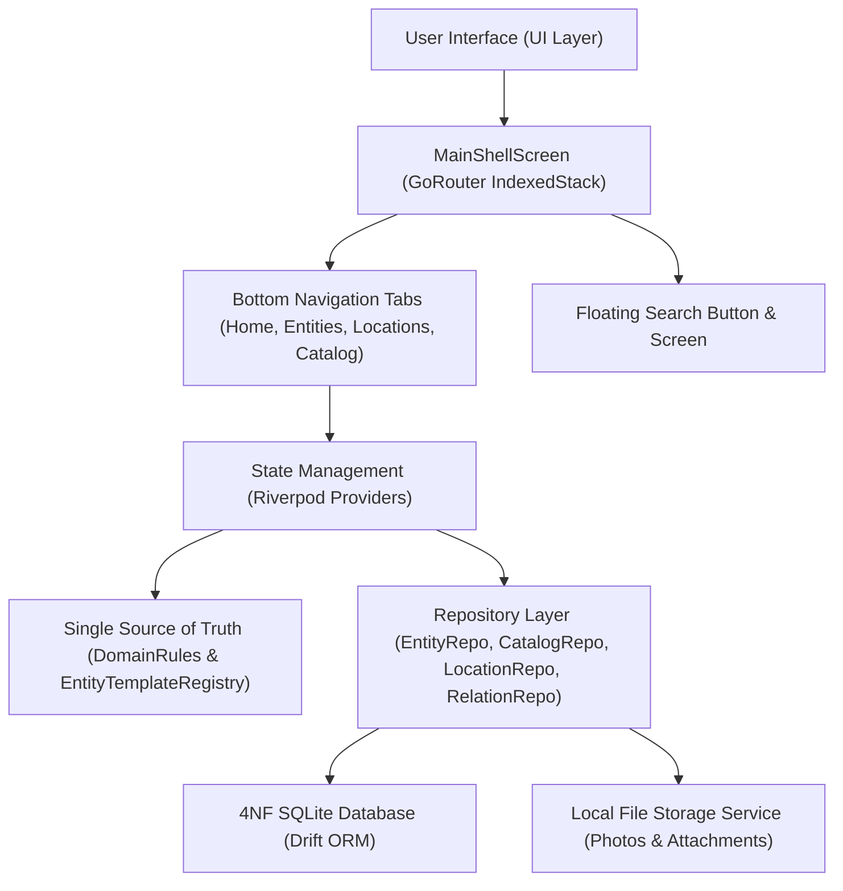

# PWMS — Platinum World Management System Documentation

Welcome to the comprehensive documentation suite for **Platinum World Management System (PWMS)**. PWMS is a personal, offline-first digital twin application built with Flutter, Riverpod, GoRouter, and Drift (SQLite).

---

## Documentation Index & Sitemap

Below is the complete sitemap of the technical documentation for PWMS located in the `docs/` directory:

| Document | Topic & Focus |
| :--- | :--- |
| 📘 [master.md](file:///Users/hakkindavid/Documents/GitHub/PlatinumWorldManagementSystem/docs/master.md) | **Product Vision & MVP Philosophy**: High-level specification, offline-first philosophy, user perception, and core design principles. |
| 🏗️ [architecture.md](file:///Users/hakkindavid/Documents/GitHub/PlatinumWorldManagementSystem/docs/architecture.md) | **System Architecture**: Clean Architecture, state management (Riverpod), routing (GoRouter), database persistence (Drift), and file storage. |
| 🗄️ [data_model.md](file:///Users/hakkindavid/Documents/GitHub/PlatinumWorldManagementSystem/docs/data_model.md) | **4NF Database Schema & Domain Models**: Normalized database tables, relational foreign keys, Freezed domain entities, and data mappings. |
| 📏 [domain_rules.md](file:///Users/hakkindavid/Documents/GitHub/PlatinumWorldManagementSystem/docs/domain_rules.md) | **Domain Rules & Single Source of Truth**: Single source of truth (`DomainRules`), strict unit validations, integer formatting, and entity subgroup rules. |
| 🌳 [location_graph.md](file:///Users/hakkindavid/Documents/GitHub/PlatinumWorldManagementSystem/docs/location_graph.md) | **Location Graph & Spatial Hierarchy**: Global graph structure, recursive item counting, anti-cycling rules, and breadcrumb path generation. |
| 🔀 [directed_relations.md](file:///Users/hakkindavid/Documents/GitHub/PlatinumWorldManagementSystem/docs/directed_relations.md) | **Directed Entity Relations**: Directed relationships (`DOCUMENTA`, `PARTE_DE`, `PERTENECE_A`, `USA`, `GUARDADO_EN`), interactive vertical graph, and edit-scoped modal. |
| ⚖️ [magnitudes_and_units.md](file:///Users/hakkindavid/Documents/GitHub/PlatinumWorldManagementSystem/docs/magnitudes_and_units.md) | **Physical Magnitudes & Multi-Unit System**: 4NF multi-unit magnitude properties, dynamic `+` / `-` species controls, wheel pickers, and empty default handling. |
| 🎨 [navigation_and_ui.md](file:///Users/hakkindavid/Documents/GitHub/PlatinumWorldManagementSystem/docs/navigation_and_ui.md) | **UI & Navigation Architecture**: `MainShellScreen`, persistent tab builder, search tab, PNG alpha transparency, and `BoxFit.contain` photo preview. |

---

## Core System Architecture Overview

---

## Key System Directives & Rules

1. **4NF Database Normalization**:
   - Physical magnitude properties are stored in 1:N relational tables (`SpeciesMagnitudesTable` and `InstanceMagnitudesTable`).
   - No primary `quantity` or `unit` columns exist on `CatalogTable` or `EntitiesTable`.
2. **Zero Auto-Injected Defaults**:
   - Species and instances created without explicitly added magnitude properties remain with `magnitudes: []`.
3. **Single Source of Truth (`DomainRules`)**:
   - All validation logic, unit compatibility rules, and integer magnitude display formatting (`5` instead of `5.0`) are centralized in [DomainRules](file:///Users/hakkindavid/Documents/GitHub/PlatinumWorldManagementSystem/lib/src/core/domain/domain_rules.dart).
4. **Edit-Scoped Relation & Attachment Actions**:
   - Creating, editing, or deleting directed entity relations and attaching files can ONLY be performed when the entity is in **Edit Mode** (`_isEditingInPlace == true`).
5. **Alpha Transparency & Photo Fitting**:
   - All thumbnail and photo cards use `BoxFit.contain` with transparent backgrounds to render PNG/WebP images with alpha channels without opaque boxes.
