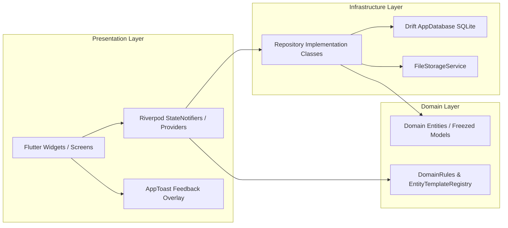

# PWMS Technical Architecture & Infrastructure Guide

This document outlines the software architecture, design patterns, state management, notification layer, and persistence layer of the **Platinum World Management System (PWMS)**.

---

## 1. High-Level Architectural Pattern

PWMS strictly adheres to **Clean Architecture** combined with **Feature-First Project Structure**. The application is structured into clear, decoupled layers:

```
lib/
 ├── main.dart
 └── src/
      ├── core/                     # Shared cross-cutting concerns
      │    ├── constants/            # Global UI strings (AppStrings) and registries
      │    ├── database/             # Drift SQLite database schema (AppDatabase)
      │    ├── domain/               # DomainRules single source of truth
      │    ├── providers/            # Riverpod global dependency injection
      │    ├── router/               # GoRouter configuration & routes
      │    ├── storage/              # FileStorageService for local disk assets
      │    ├── theme/                # Material 3 dark/light themes
      │    └── widgets/              # Reusable UI widgets (AppToast, AppWheelPicker, etc.)
      │
      └── features/                 # Modular feature domains
           ├── catalog/              # Species, Subspecies & Master Catalog management
           ├── entities/             # World Instances & Physical Entities
           ├── history/              # Recent Activity & Audit Logs
           ├── home/                 # Home Screen & MainShellScreen
           ├── locations/            # Spatial Location Graph & Node Tree
           ├── places/               # Alias mapping for locations
           ├── relations/            # Directed Entity Relations Graph & Requirements
           └── search/               # Real-time search engine with domain filters
```

---

## 2. Layer Responsibilities



### 2.1 Presentation Layer (`presentation/`)
- Contains Flutter `ConsumerWidget` and `ConsumerStatefulWidget` elements.
- Uses **Material 3 Design System** with dark mode styling.
- Displays feedback via `AppToast.showSuccess`, `AppToast.showError`, and `AppToast.showRestriction`.
- Listens to Riverpod state streams and dispatches user actions without embedding raw SQL or business logic.

### 2.2 Domain Layer (`domain/`)
- Pure Dart business models built with **Freezed** and **JSON Serializable**.
- Centralized validation rules in `DomainRules` ([domain_rules.dart](file:///Users/hakkindavid/Documents/GitHub/PlatinumWorldManagementSystem/lib/src/core/domain/domain_rules.dart)).
- Subgroup definitions and metadata constraints in `EntityTemplateRegistry`.

### 2.3 Infrastructure Layer (`infrastructure/`)
- Concrete implementation of data repositories (`CatalogRepository`, `EntityRepository`, `LocationRepository`, `RelationRepository`).
- Interacts directly with `AppDatabase` (Drift ORM with 12 normalized tables) and device storage (`FileStorageService`).

---

## 3. State Management (Riverpod)

PWMS uses **Flutter Riverpod** (`flutter_riverpod`) for compile-safe, testable dependency injection and reactive state notification.

### 3.1 Core Providers Architecture

```dart
// Database Instance Provider
final databaseProvider = Provider<AppDatabase>((ref) {
  final db = AppDatabase();
  ref.onDispose(() => db.close());
  return db;
});

// Repository Providers
final catalogRepositoryProvider = Provider<CatalogRepository>((ref) => CatalogRepository(ref.watch(databaseProvider)));
final entityRepositoryProvider = Provider<EntityRepository>((ref) => EntityRepository(ref.watch(databaseProvider)));
final locationRepositoryProvider = Provider<LocationRepository>((ref) => LocationRepository(ref.watch(databaseProvider)));
final relationRepositoryProvider = Provider<RelationRepository>((ref) => RelationRepository(ref.watch(databaseProvider)));
```

### 3.2 Reactive State Providers
- `catalogListProvider`: Manages global list of species catalog items (`AsyncNotifierProvider`).
- `entityListProvider`: Manages all instantiated world entities (`AsyncNotifierProvider`).
- `locationNodeListProvider`: Manages spatial location nodes in the graph tree.
- `entityRelationsProvider(entityId)`: `FutureProvider.family` yielding all incoming and outgoing directed relations for a specific entity.
- `speciesAttachmentsProvider(speciesId)`: `FutureProvider.family` yielding all attached documents/files for a species.

---

## 4. Navigation & Routing (GoRouter)

Routing is powered by `GoRouter` using a persistent bottom shell:

- **Shell Route**: `StatefulShellRoute.indexedStack` maintains tab state in memory across navigation transitions.
- **Tabs**:
  1. `/` $\rightarrow$ `HomeScreen` (Home tab)
  2. `/entities` $\rightarrow$ `EntitiesTab` (Instancias tab)
  3. `/locations` $\rightarrow$ `LocationsGraphScreen` (Ubicaciones tab)
  4. `/catalog` $\rightarrow$ `CatalogScreen` (Catálogo tab)
- **Modal & Parameterized Routes**:
  - `/search` $\rightarrow$ `SearchScreen` (Floating search overlay)
  - `/entity/:id` $\rightarrow$ `EntityDetailScreen` (Instance detail & directed graph)
  - `/catalog/:id` $\rightarrow$ `SpeciesDetailScreen` (Species detail view)

---

## 5. Toast Notification System (`AppToast`)

To provide non-intrusive, high-priority feedback above bottom sheets and dialogs, feedback is centralized in [AppToast](file:///Users/hakkindavid/Documents/GitHub/PlatinumWorldManagementSystem/lib/src/core/widgets/app_toast.dart):

- `AppToast.showSuccess(context, message)`: Renders green success notification.
- `AppToast.showError(context, message)`: Renders red error notification.
- `AppToast.showRestriction(context, message)`: Renders amber restriction/warning notification.

---

## 6. Local File Storage (`FileStorageService`)

Media assets (photos, images, documents) are stored on disk in the application directory rather than inside SQLite BLOBs to maximize database performance.

- `saveFile(String sourceFilePath)`: Copies file to local app storage with unique UUID filename and returns a relative path string.
- `getAbsolutePath(String relativePath)`: Resolves relative path to absolute disk path for rendering with `Image.file` or opening via `OpenFile.open()`.
