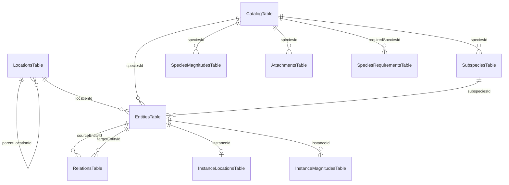

# PWMS 4NF Database Schema & Domain Data Models

This document details the **Fourth Normal Form (4NF)** relational database schema and domain model structure of the **Platinum World Management System (PWMS)**.

---

## 1. 4NF Normalization Guarantee

PWMS enforces strict **Fourth Normal Form (4NF)** database normalization:

1. **Elimination of Multi-Valued Dependencies**: Physical properties (such as mass, volume, length, counts, pricing) are stored in dedicated 1:N relational tables (`SpeciesMagnitudesTable` and `InstanceMagnitudesTable`) instead of concatenated string fields or primary columns.
2. **Subspecies Normalization**: Variants and brands are stored in a dedicated 1:N relational table (`SubspeciesTable`) linked to `CatalogTable`.
3. **No Primary Column Auto-Injection**: `CatalogTable` and `EntitiesTable` contain **NO** `quantity`, `unit`, `defaultUnit`, or monetary columns. Physical magnitudes exist strictly as relational rows.

---

## 2. Relational Database ERD Schema

---

## 3. Drift Database Tables Specification (12 Tables)

### 3.1 `LocationsTable`
Stores spatial nodes in the global location tree.

| Column | Type | Constraints | Description |
| :--- | :--- | :--- | :--- |
| `id` | `Text` | Primary Key | Unique UUID string |
| `name` | `Text` | NOT NULL | Name of the place/location |
| `parentLocationId` | `Text` | Nullable, FK -> `LocationsTable.id` | Parent location ID in node tree |
| `description` | `Text` | Nullable | Optional location notes |
| `icon` | `Text` | Nullable | Material icon representation |
| `createdAt` | `DateTime` | NOT NULL | Creation timestamp |

---

### 3.2 `CatalogTable` (Especies)
Master definitions for item species in the world.

| Column | Type | Constraints | Description |
| :--- | :--- | :--- | :--- |
| `id` | `Text` | Primary Key | Unique UUID string |
| `name` | `Text` | NOT NULL | Species name |
| `type` | `Text` | Default: `'Objeto'` | Subgroup type (`Objeto`, `Ser Vivo`, `Documento`, `Proyecto`, `Recuerdo`) |
| `description` | `Text` | Nullable | Master description |
| `mainPhotoPath` | `Text` | Nullable | Relative disk path to main photo |
| `customAttributes` | `Text` | Default: `'{}'` | JSON map of custom metadata |
| `isUnique` | `Bool` | Default: `false` | Uniqueness flag |
| `createdAt` | `DateTime` | NOT NULL | Creation timestamp |

---

### 3.3 `SubspeciesTable` (Subespecies y Variantes 4NF)
Subspecies, brands, and product model variants linked to a species.

| Column | Type | Constraints | Description |
| :--- | :--- | :--- | :--- |
| `id` | `Text` | Primary Key | Unique UUID string |
| `speciesId` | `Text` | FK -> `CatalogTable.id` | Species foreign key |
| `subspeciesName` | `Text` | NOT NULL | Subspecies or variant name |
| `brand` | `Text` | Nullable | Brand name (Allowed only for `Objeto`) |
| `barcode` | `Text` | Nullable | Barcode / QR string (Allowed only for `Objeto`) |
| `photoPath` | `Text` | Nullable | Relative path to subspecies photo |
| `notes` | `Text` | Nullable | Specific variant notes |
| `createdAt` | `DateTime` | NOT NULL | Creation timestamp |

---

### 3.4 `SpeciesMagnitudesTable` (Magnitudes de Especie 4NF)
Physical magnitude properties defined on a species.

| Column | Type | Constraints | Description |
| :--- | :--- | :--- | :--- |
| `id` | `Text` | Primary Key | Unique UUID string |
| `speciesId` | `Text` | FK -> `CatalogTable.id` | Species foreign key |
| `propertyName` | `Text` | NOT NULL | Property name (e.g. `"Masa"`, `"Longitud"`, `"Volumen"`) |
| `unitSymbol` | `Text` | NOT NULL | Unit symbol (e.g. `"kg"`, `"m"`, `"L"`, `"unidad"`) |
| `createdAt` | `DateTime` | NOT NULL | Creation timestamp |

---

### 3.5 `EntitiesTable` (Instancias del Mundo)
Instantiated physical entities located in the world.

| Column | Type | Constraints | Description |
| :--- | :--- | :--- | :--- |
| `id` | `Text` | Primary Key | Unique UUID string |
| `speciesId` | `Text` | FK -> `CatalogTable.id` | Species foreign key |
| `subspeciesId` | `Text` | Nullable, FK -> `SubspeciesTable.id` | Subspecies foreign key |
| `locationId` | `Text` | Nullable, FK -> `LocationsTable.id` | Current location foreign key |
| `notes` | `Text` | Nullable | Instance-specific notes |
| `createdAt` | `DateTime` | NOT NULL | Creation timestamp |
| `updatedAt` | `DateTime` | NOT NULL | Modification timestamp |

---

### 3.6 `InstanceMagnitudesTable` (Magnitudes de Instancia 4NF)
Physical magnitude properties recorded on specific instance entities.

| Column | Type | Constraints | Description |
| :--- | :--- | :--- | :--- |
| `id` | `Text` | Primary Key | Unique UUID string |
| `instanceId` | `Text` | FK -> `EntitiesTable.id` | Instance entity foreign key |
| `propertyName` | `Text` | NOT NULL | Property name |
| `magnitudeValue` | `Real` | NOT NULL | Numeric magnitude value |
| `unitSymbol` | `Text` | NOT NULL | Unit symbol |

---

### 3.7 `InstanceLocationsTable` (Ubicaciones Directas 4NF)
Direct physical location assignment table.

| Column | Type | Constraints | Description |
| :--- | :--- | :--- | :--- |
| `instanceId` | `Text` | Primary Key, FK -> `EntitiesTable.id` | Instance entity foreign key |
| `locationId` | `Text` | FK -> `LocationsTable.id` | Direct location foreign key |
| `createdAt` | `DateTime` | NOT NULL | Assignment timestamp |

---

### 3.8 `RelationsTable` (Relaciones Dirigidas)
Directed relationships between instances (`sourceEntityId ➔ targetEntityId`).

| Column | Type | Constraints | Description |
| :--- | :--- | :--- | :--- |
| `id` | `Text` | Primary Key | Unique UUID string |
| `sourceEntityId` | `Text` | FK -> `EntitiesTable.id` | Origin entity ID |
| `targetEntityId` | `Text` | FK -> `EntitiesTable.id` | Target entity ID |
| `relationType` | `Text` | NOT NULL | Relationship verb (`DOCUMENTA`, `PARTE_DE`, `PERTENECE_A`, `USA`, `GUARDADO_EN`) |
| `createdAt` | `DateTime` | NOT NULL | Creation timestamp |

---

### 3.9 `SpeciesRequirementsTable` (Requisitos de Especie 4NF)
Dependency requirements between species (`sourceId NECESITA requiredSpeciesId`).

| Column | Type | Constraints | Description |
| :--- | :--- | :--- | :--- |
| `id` | `Text` | Primary Key | Unique UUID string |
| `sourceId` | `Text` | NOT NULL | Source species ID |
| `sourceType` | `Text` | Default: `'species'` | Source type string |
| `requiredSpeciesId` | `Text` | FK -> `CatalogTable.id` | Required species foreign key |
| `requiredQuantity` | `Real` | Default: `1.0` | Required quantity amount |
| `notes` | `Text` | Nullable | Requirement notes |
| `createdAt` | `DateTime` | NOT NULL | Creation timestamp |

---

### 3.10 `AttachmentsTable`
Documents and attachments attached to species.

| Column | Type | Constraints | Description |
| :--- | :--- | :--- | :--- |
| `id` | `Text` | Primary Key | Unique UUID string |
| `speciesId` | `Text` | FK -> `CatalogTable.id` | Species foreign key |
| `filePath` | `Text` | NOT NULL | Relative disk path to file |
| `fileName` | `Text` | NOT NULL | Original filename |
| `fileType` | `Text` | NOT NULL | Extension / mime category |
| `createdAt` | `DateTime` | NOT NULL | Attachment timestamp |

---

### 3.11 `HistoryEventsTable`
Automatic audit trail of user actions.

| Column | Type | Constraints | Description |
| :--- | :--- | :--- | :--- |
| `id` | `Text` | Primary Key | Unique UUID string |
| `entityId` | `Text` | Nullable | Target entity ID |
| `eventType` | `Text` | NOT NULL | Event type string |
| `description` | `Text` | NOT NULL | Human-readable log summary |
| `metadata` | `Text` | Nullable | Extra JSON payload |
| `timestamp` | `DateTime` | NOT NULL | Log timestamp |

---

### 3.12 `CustomTemplatesTable`
User-customized category templates.

| Column | Type | Constraints | Description |
| :--- | :--- | :--- | :--- |
| `id` | `Text` | Primary Key | Unique UUID string |
| `typeName` | `Text` | NOT NULL | Template name |
| `iconName` | `Text` | NOT NULL | Material icon identifier |
| `commonUnits` | `Text` | Default: `'[]'` | JSON array of default units |
| `createdAt` | `DateTime` | NOT NULL | Creation timestamp |

---

## 4. Freezed Domain Models Mappings

All domain entities in Dart use `@freezed` to guarantee immutability:

- `CatalogItem`: Freezed model mapping `CatalogTable` row and its list of `List<SpeciesMagnitude> magnitudes`.
- `Subspecies`: Freezed model mapping `SubspeciesTable` row.
- `WorldEntity`: Freezed model mapping `EntitiesTable` row and its list of `List<InstanceMagnitude> magnitudes`.
- `LocationNode`: Freezed model mapping `LocationsTable` row.
- `EntityRelation`: Freezed model mapping `RelationsTable` row.
- `SpeciesRequirement`: Freezed model mapping `SpeciesRequirementsTable` row.
- `Attachment`: Freezed model mapping `AttachmentsTable` row.
- `ActivityEvent`: Freezed model mapping `HistoryEventsTable` row.
