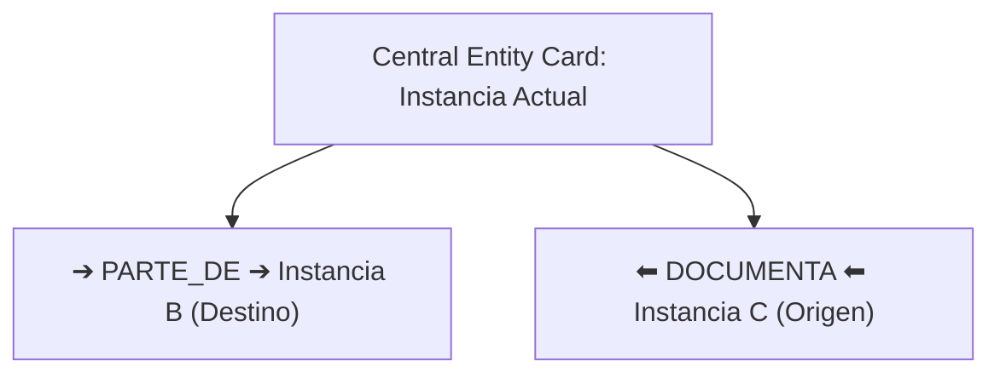

# PWMS Directed Entity Relations & Interactive Graph Specification

This document details the directed relationships system, interactive vertical graph widget, and edit-scoped relation modal in **Platinum World Management System (PWMS)**.

---

## 1. Directed Relations Conceptual Model

Unlike symmetric links, relationships between world entities in PWMS are **Directed Edges** with an explicit source (origin), target (destination), and relationship verb.

```
[Source Entity] ─── (Relation Verb) ───► [Target Entity]
```

### Supported Directed Relation Verbs:
- `PARTE_DE`: Source entity is a component of target entity.
- `DOCUMENTA`: Source entity documents or contains manual/specs for target entity.
- `PERTENECE_A`: Source entity belongs to target entity.
- `USA`: Source entity uses or requires target entity.
- `GUARDADO_EN`: Source entity is stored inside target entity.

---

## 2. Interactive Directed Graph Widget (`InteractiveEntityGraphWidget`)

Rendered on `EntityDetailScreen`, [InteractiveEntityGraphWidget](file:///Users/hakkindavid/Documents/GitHub/PlatinumWorldManagementSystem/lib/src/features/relations/presentation/interactive_entity_graph_widget.dart) provides a visual representation of directed edges in a **Vertical Column Layout**.



### Visual Features:
- **Central Node Card**: Displays current instance name highlighted in theme primary color.
- **Vertical Connection Cards**: Each directed relation is rendered as a clean card showing:
  1. Directional badge (`➔` or `⬅`) with relationship type label.
  2. Connected entity name and direction role (`Destino` vs `Origen`).
  3. Interactive navigation icon (`open_in_new`) that navigates directly to `/entity/:id`.
  4. Deletion icon button (`close`) displayed **only** in Edit Mode.

---

## 3. Strict Edit-Mode Scoping Rule

To prevent accidental modifications while inspecting entities, **creating, editing, or deleting directed entity relations is strictly scoped to Edit Mode (`_isEditingInPlace == true`)**:

- **View Mode (`_isEditingInPlace == false`)**:
  - The **"Relacionar"** action button is hidden.
  - The deletion **"X"** icon buttons on directed edges are hidden.
  - Graph remains fully interactive for navigation to connected entities.
- **Edit Mode (`_isEditingInPlace == true`)**:
  - Displays **"Relacionar"** button to open `CreateRelationModal`.
  - Displays deletion **"X"** buttons on each directed edge card to delete relationships.

---

## 4. Modal "Relacionar Entidad" (`CreateRelationModal`)

Located in [create_relation_modal.dart](file:///Users/hakkindavid/Documents/GitHub/PlatinumWorldManagementSystem/lib/src/features/relations/presentation/create_relation_modal.dart):

1. Presents a search/picker list of all available target entities in the world.
2. Provides an `AppWheelPicker` selector for choosing the directed relation type (`PARTE_DE`, `DOCUMENTA`, `PERTENECE_A`, `USA`, `GUARDADO_EN`).
3. Saves `EntityRelation` to `RelationsTable` via `RelationRepository` and invalidates Riverpod providers to immediately refresh the graph.
