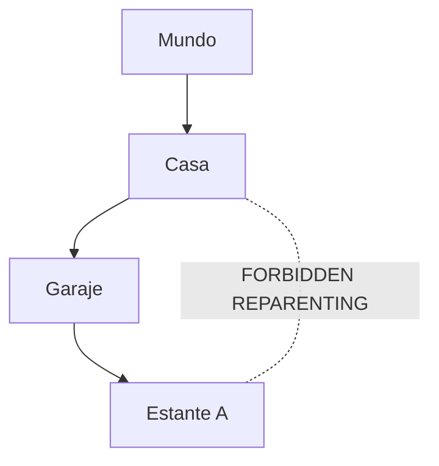

# PWMS Spatial Location Graph & Hierarchy Specification

This document details the spatial location graph, recursive item counter algorithm, anti-cycling reparenting rules, container `@` indicator, and path navigation helpers in **Platinum World Management System (PWMS)**.

---

## 1. Global Location Graph Architecture

Locations in PWMS form a **Global Spatial Graph (Hierarchical Tree)** where each location node ([LocationNode](file:///Users/hakkindavid/Documents/GitHub/PlatinumWorldManagementSystem/lib/src/features/locations/domain/location_node.dart)) can have zero or one parent location (`parentLocationId`) and multiple child locations.

- **Root Location**: When `parentLocationId == null`, the location resides directly at the root of the world ("Mundo").
- **Sub-Locations**: Locations nested inside other locations (e.g., `Mundo ➔ Casa ➔ Garaje ➔ Estante A ➔ Caja 1`).

---

## 2. Recursive Item Counter Engine

Every location node displays the total sum of items it contains, including items residing inside all of its descendant child nodes.

```dart
static int getRecursiveItemCount(
  String nodeId,
  List<LocationNode> allNodes,
  List<WorldEntity> allEntities,
) {
  // 1. Direct items at this location node
  int totalCount = allEntities.where((e) => e.locationId == nodeId).length;

  // 2. Recursively add items from all child nodes
  final children = allNodes.where((n) => n.parentLocationId == nodeId);
  for (final child in children) {
    totalCount += getRecursiveItemCount(child.id, allNodes, allEntities);
  }

  return totalCount;
}
```

---

## 3. Container Relational Indicator (`@`) in Breadcrumbs

When an entity is stored inside another entity container via `GUARDADO_EN` (e.g. eggs inside a refrigerator, batteries inside a flashlight), the location path helper resolves the container's physical location and appends the container symbol `@`:

```
Casa > Cocina @ Refrigerador
```

Implemented in `LocationPathHelper.buildEffectiveBreadcrumb`:

```dart
final effectiveBreadcrumb = LocationPathHelper.buildEffectiveBreadcrumb(
  entityId: eggInstance.id,
  effectiveLocationId: fridgeInstance.locationId,
  allEntities: allEntities,
  allRelations: [guardadoRel],
  allNodes: allNodes,
  catalogItems: [fridgeSpecies, eggSpecies],
);
// effectiveBreadcrumb.ancestorPath -> "Casa > Cocina @"
// effectiveBreadcrumb.targetName   -> "Refrigerador"
```

---

## 4. Anti-Cycling & Reparenting Protection

Locations **CANNOT** be moved inside themselves or inside any of their child/descendant nodes, as this would create cyclic graph loops and infinite recursion.



### 4.1 Descendant Traversal Algorithm

```dart
Set<String> getDescendantIds(String nodeId, List<LocationNode> allNodes) {
  final Set<String> descendants = {};
  void findChildren(String pId) {
    final children = allNodes.where((n) => n.parentLocationId == pId);
    for (final child in children) {
      descendants.add(child.id);
      findChildren(child.id);
    }
  }
  findChildren(nodeId);
  return descendants;
}

bool canMoveNode(String nodeId, String? targetParentId, List<LocationNode> allNodes) {
  if (targetParentId == null) return true; // Moving to Root is allowed
  if (nodeId == targetParentId) return false; // Self-parenting forbidden
  final descendants = getDescendantIds(nodeId, allNodes);
  return !descendants.contains(targetParentId); // Descendant parenting forbidden
}
```

---

## 5. Location Breadcrumbs Trajectory Helper

When viewing an entity tile or entity detail screen, the location path describes the complete trajectory, rendering ancestor nodes in smaller text before the target node.

```
Mundo > Casa > Garaje > Estante 1 > [Caja 3]
```

Implemented in [LocationPathHelper](file:///Users/hakkindavid/Documents/GitHub/PlatinumWorldManagementSystem/lib/src/features/locations/domain/location_path_helper.dart).
