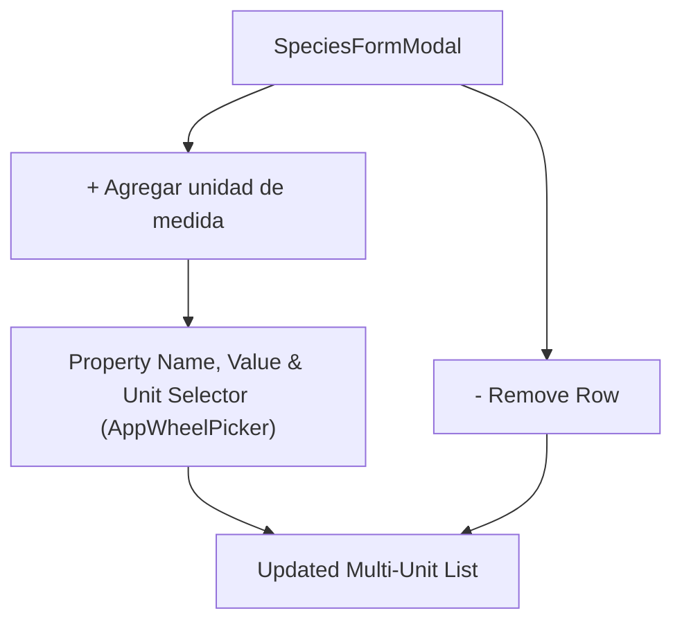

# PWMS Physical Magnitudes, Multi-Unit System & Wheel Pickers

This document details the multi-unit magnitude system, dynamic `+` / `-` property controls, wheel pickers, integer formatting, and the complete elimination of default magnitudes in **Platinum World Management System (PWMS)**.

---

## 1. Physical Magnitudes Architecture

Physical properties of items in PWMS (such as mass, volume, length, counts, dimensions) are modeled in 4NF relational tables (`SpeciesMagnitudesTable` and `InstanceMagnitudesTable`).

### Key Properties:
- `propertyName`: String identifier (e.g. `"Masa"`, `"Longitud"`, `"Volumen"`, `"Masa Total"`).
- `magnitudeValue`: Numeric double value (e.g. `10.5`, `100.0`).
- `unitSymbol`: Standardized unit string (e.g. `"kg"`, `"m"`, `"L"`, `"unidad"`).

---

## 2. Dynamic `+` / `-` Multi-Unit Controls in `SpeciesFormModal`

When creating or editing a species in [SpeciesFormModal](file:///Users/hakkindavid/Documents/GitHub/PlatinumWorldManagementSystem/lib/src/features/catalog/presentation/species_form_modal.dart), users can dynamically manage multiple unit properties:

- **`+ Agregar unidad de medida`**: Opens a dialog to define property name, initial value, and unit symbol from allowed unit choices.
- **`- Eliminar unidad de medida`**: Instantly removes a magnitude property row.

---

## 3. Universal Cupertino Wheel Pickers

All dropdown pickers across PWMS have been replaced with smooth, touch-friendly **Cupertino Wheel Pickers**:

### 3.1 `AppWheelPicker`
Located in [app_wheel_picker.dart](file:///Users/hakkindavid/Documents/GitHub/PlatinumWorldManagementSystem/lib/src/core/widgets/app_wheel_picker.dart):
- Generic Cupertino picker sheet used for choosing units, template species, relationship types, and domain categories.

### 3.2 `IntegerWheelPicker`
Located in [integer_wheel_picker.dart](file:///Users/hakkindavid/Documents/GitHub/PlatinumWorldManagementSystem/lib/src/core/widgets/integer_wheel_picker.dart):
- Wheel picker tailored for integer magnitude adjustments (e.g., changing quantity counts from `0` to `100`).

---

## 4. Total Elimination of Default Magnitudes

In accordance with strict user directives:

- **Zero Auto-Injection**: When creating a species or instantiating an entity without explicitly adding magnitude properties, `magnitudes` remains an **empty list** (`[]`).
- **No Hardcoded Defaults**: The system never auto-injects default `"unidad"` or `"Cantidad"` rows.

---

## 5. Total Financial Infrastructure Purge

PWMS contains **ZERO** financial code, monetary fields, or transaction tracking:

- **Database Purge**: `FinancialTransactionsTable` and monetary columns (`isSubjectToPurchase`, `isSubjectToSale`, `defaultMonetaryCurrency`) are completely purged from database schemas.
- **Repository & UI Purge**: All acquisition cost prompts, sale prompts, currency selectors (`MXN`/`USD`), and financial badges are completely removed.
