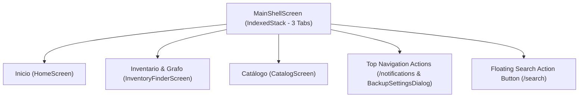

# PWMS UI Design System, Navigation & Layout Architecture

This document details the user interface layout, design system, navigation shell, image rendering rules, toast notifications, system alerts, and screen workflows of the **Platinum World Management System (PWMS)**.

---

## 1. UI Philosophy & Design Aesthetics

PWMS utilizes **Material 3 Design System** with a curated dark theme (`AppTheme.darkTheme`), dynamic micro-animations, glassmorphism card containers, and clean typography:

- **Primary Colors**: Sleek dark surface (`0xFF121212`), primary accent (`0xFF6366F1`), secondary accent (`0xFF10B981`), and warning/unique amber (`0xFFF59E0B`).
- **No Cluttered Forms**: Capture forms rely on touch-friendly wheel pickers (`AppWheelPicker`) and modal sheets rather than long inputs.

---

## 2. Navigation Shell (`MainShellScreen`)

The core shell of the application is built on `GoRouter`'s `StatefulShellRoute.indexedStack`, keeping all 3 main tab states active in memory without rebuilding widget trees on tab switches.

---

## 3. Core Screens & Workflows

### 3.1 Tab 1: Inicio (`HomeScreen`)
- **Header**: Dynamic greeting, notification bell indicator badge, backup settings action button, and quick stats.
- **Recent Entities**: Horizontal scroll view displaying recent instances with subspecies photo and subspecies title.
- **Recent Activity Log**: Shows the 3 most recent automatic system events with a "Ver todo" modal trigger.

### 3.2 Tab 2: Inventario & Grafo (`InventoryFinderScreen`)
- Unified inventory search and spatial graph inspection screen.
- **Top Curtain Location Selector ([TopCurtainLocationSheet](file:///Users/hakkindavid/Documents/GitHub/PlatinumWorldManagementSystem/lib/src/features/locations/presentation/top_curtain_location_sheet.dart))**: Sliding top-down curtain allowing direct spatial location navigation and filtering.
- **View Modes**: Supports list tiles, effective grouped instance tiles ([EffectiveGroupTile](file:///Users/hakkindavid/Documents/GitHub/PlatinumWorldManagementSystem/lib/src/features/entities/presentation/effective_group_tile.dart)), and visual grid tiles ([MinecraftTileWidget](file:///Users/hakkindavid/Documents/GitHub/PlatinumWorldManagementSystem/lib/src/features/entities/presentation/minecraft_tile_widget.dart)).

### 3.3 Tab 3: Catálogo (`CatalogScreen`)
- Master list of species templates in the catalog.
- Includes filter chips for filtering by subgroup type (`Todos`, `Objeto`, `Ser Vivo`, `Documento`, `Proyecto`, `Recuerdo`).
- Tapping `+` opens `RegisterObjectModal`.

### 3.4 Notifications Screen (`NotificationsScreen` / `/notifications`)
- Lists active, snoozed, and dismissed system alerts for expired entities, products expiring soon, and unsatisfied catalog dependencies.

### 3.5 Grouped Instance Inspector (`GroupedInstanceDetailScreen` / `/grouped-instance-detail`)
- Dedicated screen for inspecting and performing batch operations (quantity adjustments, location moves, deletions) on grouped physical instances sharing identical species, subspecies, and location.

### 3.6 Floating Search Button & Screen (`SearchScreen`)
- Floating search button accessible across main tabs.
- Offers real-time filtering across name, brand, barcode, subgroup type, notes, location, or catalog items.

---

## 4. Modal Sheets Architecture

1. **`RegisterObjectModal`**:
   - Features a 3-way segmented control:
     - `Instanciar`: Browse catalog species to instantiate into the world.
     - `Crear especie`: Embedded `SpeciesFormModal` to register a brand new species.
     - `Crear subespecie`: Target species selector and `SubspeciesSectionWidget(isEditing: true)` to define subspecies/brand variants.
2. **`SpeciesFormModal`**:
   - Used for creating or editing species definitions, attaching documents, managing magnitude rows (`+` / `-`), auto-filling barcode info via `AutoFillScannerWidget`, and choosing web images via `WebImagePickerDialog`.
3. **`InstantiateSpeciesSheet`**:
   - Modal for instantiating a species into a world location, specifying target location, subspecies variant, expiration date (if perishable), custom notes, and initial physical magnitudes.
4. **`AddEditSubspeciesModal`**:
   - Dedicated modal sheet for creating or updating a specific subspecies variant and barcode.
5. **`TopCurtainLocationSheet`**:
   - Top-down curtain modal for selecting spatial location scope.
6. **`BackupSettingsDialog`**:
   - Modal dialog for local JSON database export, import, and backup restoration.

---

## 5. Toast Notification Architecture (`AppToast`)

User feedback across all modals and screens is provided via [AppToast](file:///Users/hakkindavid/Documents/GitHub/PlatinumWorldManagementSystem/lib/src/core/widgets/app_toast.dart):

- `AppToast.showSuccess(context, message)`: Renders green success banner.
- `AppToast.showError(context, message)`: Renders red error banner.
- `AppToast.showRestriction(context, message)`: Renders amber restriction banner.

---

## 6. Photo Fitting & Alpha Transparency Rules

### 6.1 `BoxFit.contain` Photo Fitting
Across all species and instance photo previews ([SpeciesTile](file:///Users/hakkindavid/Documents/GitHub/PlatinumWorldManagementSystem/lib/src/features/catalog/presentation/species_tile.dart), [EntityTile](file:///Users/hakkindavid/Documents/GitHub/PlatinumWorldManagementSystem/lib/src/features/entities/presentation/entity_tile.dart), [SpeciesDetailView](file:///Users/hakkindavid/Documents/GitHub/PlatinumWorldManagementSystem/lib/src/features/catalog/presentation/species_detail_view.dart), `SpeciesFormModal`), images use **`fit: BoxFit.contain`**.
- This guarantees 100% of the image is visible without cropping or stretching non-dominant dimensions.

### 6.2 Alpha Transparency Support
Containers holding photo thumbnails do **NOT** use opaque background fills. PNG and WebP images with alpha transparency render cleanly on top of dark card backgrounds without gray or white box fills.

