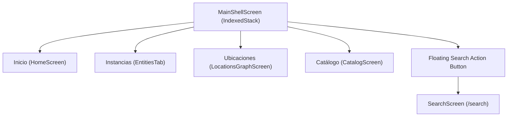

# PWMS UI Design System, Navigation & Layout Architecture

This document details the user interface layout, design system, navigation shell, image rendering rules, and screen workflows of the **Platinum World Management System (PWMS)**.

---

## 1. UI Philosophy & Design Aesthetics

PWMS utilizes **Material 3 Design System** with a curated dark theme (`AppTheme.darkTheme`), dynamic micro-animations, glassmorphism card containers, and clean typography:

- **Primary Colors**: Sleek dark surface (`0xFF121212`), primary accent (`0xFF6366F1`), secondary accent (`0xFF10B981`), and warning/unique amber (`0xFFF59E0B`).
- **No Cluttered Forms**: Capture forms rely on touch-friendly wheel pickers (`AppWheelPicker`) and modal sheets rather than long inputs.

---

## 2. Navigation Shell (`MainShellScreen`)

The core shell of the application is built on `GoRouter`'s `StatefulShellRoute.indexedStack`, keeping all tab states active in memory without rebuilding widget trees on tab switches.

---

## 3. Core Screens & Workflows

### 3.1 Tab 1: Inicio (`HomeScreen`)
- **Header**: Dynamic greeting and quick stats.
- **Recent Entities**: Horizontal scroll view of recently created or moved instances.
- **Recent Activity Log**: Shows the 3 most recent automatic system events with a "Ver todo" modal trigger.

### 3.2 Tab 2: Instancias (`EntitiesTab`)
- Displays all physical world entities currently instantiated in the user's world.
- Rendered via [EntityTile](file:///Users/hakkindavid/Documents/GitHub/PlatinumWorldManagementSystem/lib/src/features/entities/presentation/entity_tile.dart), displaying species photo thumbnail, name, subgroup type, full breadcrumb location path (`Mundo > Casa > Garaje > Estante A`), and primary magnitude.

### 3.3 Tab 3: Ubicaciones (`LocationsGraphScreen`)
- Global spatial graph and tree view of all location nodes.
- Shows recursive item counts (`LocationRepository.getRecursiveItemCount`) and allows creating or reparenting locations.

### 3.4 Tab 4: Catálogo (`CatalogScreen`)
- Master list of species templates in the catalog.
- Includes filter chips for filtering by subgroup type (`Todos`, `Objeto`, `Ser Vivo`, `Documento`, `Proyecto`, `Recuerdo`).
- Tapping `+` opens `RegisterObjectModal` / `SpeciesFormModal`.

### 3.5 Floating Search Button & Screen (`SearchScreen`)
- Floating search button accessible across main tabs.
- Offers real-time filtering across name, brand, barcode, subgroup type, notes, location, or catalog items.

---

## 4. Photo Fitting & Alpha Transparency Rules

### 4.1 `BoxFit.contain` Photo Fitting
Across all species and instance photo previews ([SpeciesTile](file:///Users/hakkindavid/Documents/GitHub/PlatinumWorldManagementSystem/lib/src/features/catalog/presentation/species_tile.dart), [EntityTile](file:///Users/hakkindavid/Documents/GitHub/PlatinumWorldManagementSystem/lib/src/features/entities/presentation/entity_tile.dart), [SpeciesDetailView](file:///Users/hakkindavid/Documents/GitHub/PlatinumWorldManagementSystem/lib/src/features/catalog/presentation/species_detail_view.dart), `SpeciesFormModal`), images use **`fit: BoxFit.contain`**.
- This guarantees 100% of the image is visible without cropping or stretching non-dominant dimensions.

### 4.2 Alpha Transparency Support
Containers holding photo thumbnails do **NOT** use opaque background fills. PNG and WebP images with alpha transparency render cleanly on top of dark card backgrounds without gray or white box fills.

---

## 5. Attachment & Edit Mode Scoping Rules

- **Reading View Mode**: In `SpeciesDetailView` and `EntityDetailScreen`, the "Adjuntar archivo" button is hidden to present a clean reading interface.
- **Edit Mode**: File attachment controls appear strictly inside `SpeciesFormModal` when editing a species.
