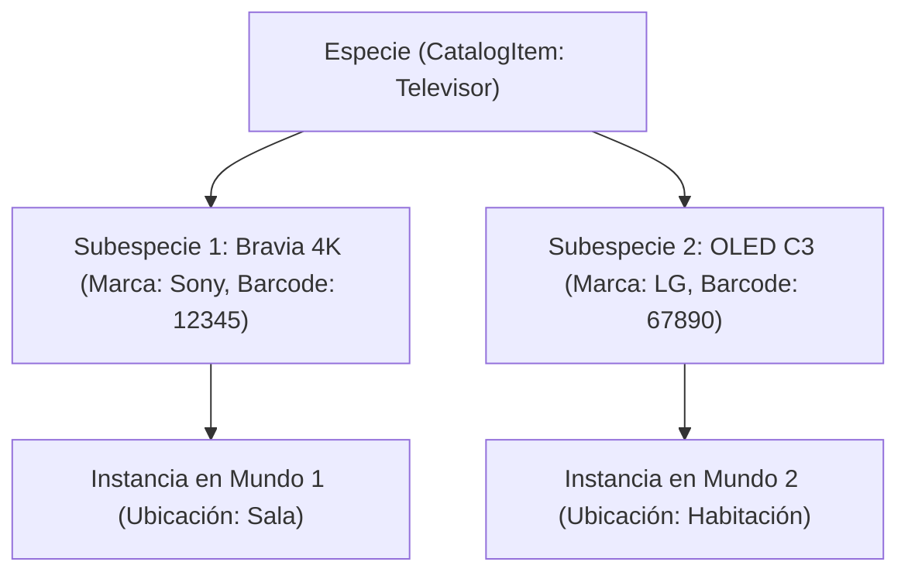

# PWMS Subspecies, Brand Variants & Visual Hierarchy Specification

This document details the subspecies and brand variant system, structural subgroup constraints, taxonomy auto-fill (`ProductLookupService`), photo resolution fallback, and visual hierarchy inversion in **Platinum World Management System (PWMS)**.

---

## 1. Conceptual Architecture: Species vs. Subspecies

In PWMS, item definitions are split into a 2-tier hierarchy:

1. **Especie (Catalog Definition)**: High-level category or model template stored in `CatalogTable` (e.g. `"Pila AA"`, `"Televisor"`, `"Gato"`, `"Manzana"`).
2. **Subespecie / Variante de Marca (Subspecies Definition)**: Concrete variant or product model stored in `SubspeciesTable` (e.g. `"Duracell Ultra"`, `"Energizer Max"`, `"Bravia 4K 55"`, `"Pancho"`, `"Mino"`).



---

## 2. 4NF Database Schema (`SubspeciesTable`)

Subspecies are normalized in a dedicated 1:N relational table:

| Column | Type | Constraints | Description |
| :--- | :--- | :--- | :--- |
| `id` | `Text` | Primary Key | Unique UUID string |
| `speciesId` | `Text` | FK -> `CatalogTable.id` | Foreign key referencing species |
| `subspeciesName` | `Text` | NOT NULL | Subspecies or variant name |
| `brand` | `Text` | Nullable | Brand name (Only allowed for `Objeto`) |
| `barcode` | `Text` | Nullable | Barcode / QR string (Only allowed for `Objeto`) |
| `photoPath` | `Text` | Nullable | Relative path to subspecies main photo |
| `notes` | `Text` | Nullable | Specific variant notes (e.g., "Edición especial") |
| `createdAt` | `DateTime` | NOT NULL | Creation timestamp |

---

## 3. Structural Constraints Across Entity Subgroups

Brand and Barcode attributes are strictly constrained by entity subgroup type:

| Subgroup Type | Brand & Barcode Allowed | Multi-Unit Magnitudes | Always Unique |
| :--- | :---: | :---: | :---: |
| **Objeto** | ✅ Yes | ✅ Yes | Optional |
| **Ser Vivo** | ❌ Stripped automatically | ✅ Yes | Optional |
| **Documento** | ❌ Stripped automatically | ❌ No | ✅ Always Unique |
| **Proyecto** | ❌ Stripped automatically | ❌ No | ✅ Always Unique |
| **Recuerdo** | ❌ Stripped automatically | ❌ No | ✅ Always Unique |

*When saving a subspecies for any subgroup other than `Objeto`, `saveSubspecies` automatically strips `brand` and `barcode` to `null`.*

---

## 4. Subspecies Registration & Product Taxonomy Intelligence

When registering or editing a subspecies via `AddEditSubspeciesModal`:

1. **Barcode Scan & Auto-Fill**: Scanning or entering a barcode triggers `ProductLookupService.lookupByBarcode()`.
2. **Taxonomy & Brand Matching**: The system checks `BrandDictionary` and `ProductTaxonomyDictionary` to infer brand name, subspecies title, perishability status, and suggested magnitude units.
3. **Dedicated Modal (`AddEditSubspeciesModal`)**: Provides isolated fields for variant title, brand, barcode, photo, and notes.

---

## 5. Main Photo Resolution & Fallback Logic

Subspecies can have their own primary image. When rendering any instance or tile:

1. If `subspecies.photoPath` exists and is non-empty, use `subspecies.photoPath`.
2. Otherwise, fall back to `species.mainPhotoPath`.

Implemented in `Subspecies.resolvePhotoPath`:

```dart
String? resolvePhotoPath(String? speciesMainPhotoPath) {
  if (photoPath != null && photoPath!.trim().isNotEmpty) {
    return photoPath;
  }
  return speciesMainPhotoPath;
}
```

---

## 6. UI Visual Hierarchy Inversion Rule

To provide maximum clarity to the user, **subspecies information is presented as the primary identity**, while the species serves as secondary context:

### 6.1 Detail Views (`SpeciesDetailView` & `EntityDetailScreen`)
- **Primary Title**: Subspecies name (e.g. `"Bravia 4K 55"`).
- **Secondary Context Badge**: Displays general species name and type (e.g. `Especie: Televisor (Objeto)`).

### 6.2 Instance Tiles (`EntityTile`, Recent Instances on `HomeScreen`)
- Displays subspecies photo, subspecies name, brand, barcode, and location trajectory without duplicating barcode legends when null.

---

## 7. Deletion Protection Rules

1. **Subspecies with Active Instances**: A subspecies cannot be deleted if any `WorldEntity` references `subspeciesId == sub.id`.
2. **Single Subspecies Rule**: The last remaining subspecies of a species cannot be deleted. Every species MUST maintain at least 1 valid subspecies.
3. **Creation Fallback**: If a species is created without adding draft subspecies, the system automatically creates a default `"Genérica"` subspecies.

